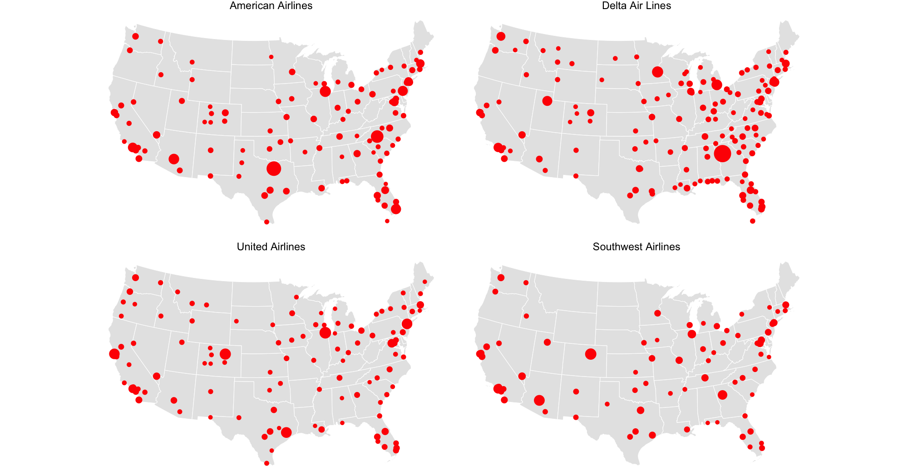

```{r setup, include=FALSE}
knitr::opts_chunk$set(echo = TRUE, eval = TRUE, warning = FALSE, message = FALSE)
```

## Packages needed

```{r}
library(tidyverse)
library(usmap)
library(sf)
```


## Dataset

The `flight_df_raw` data we have here is a complete record of all domestic flights for American, Delta, United, and Southwest in 2019 (`nycflights13::flights` contains only flights departing from NYC).

```{r}
flight_df_raw <- read_csv("data/flight_df.csv") |> select(-DepTime, -ArrTime)
airports_raw <- read_csv("data/airports.csv")
us_map_sf <-  us_map(regions = 'states') |> filter(!abbr %in% c("AK", "HI"))
```

This is some wrangling to match the coordinate reference system (CRS) of the airports with the CRS of the US map (we will talk about CRS on week 5 Friday's class).

```{r}
airports <- airports_raw |>
  # create an sf object
  st_as_sf(coords = c("x", "y"), crs = 4326) |>
  # transform to the same CRS as the us_map_sf
  st_transform(crs = st_crs(us_map_sf)) |>
  # extract the coordinates
  mutate(x = st_coordinates(geometry)[,1], y = st_coordinates(geometry)[,2]) |>
  # focus on airports on continental US
  filter(between(x, -3000000, 3000000), y < 700000) |>
  # clean up
  rename(airport = ident) |>
  as_tibble() |>
  select(airport, x, y)

airports
```


## Your goal

```{r out.width="100%", echo = FALSE}
knitr::include_graphics("figures/flights-map.png")
```

Let's dissect the components of the plot. Our plot contains three layers:

1) The underlying map using the `us_map_sf` data. We will cover how to create a map in week 5 Friday.

2) The points for the airport: we want to show the location of all the airports, both origin and destination. The size of the points are proportional to the number of flights at the airport. All the points are red.

3) The lines for the routes: we want to show all the routes between two airports. Each route is represented by a line segment connecting the two airports. We make them dim (low alpha) so that the map is not too busy (also red).


## Points representing the airports

You may want your data to look like this :

|airline | airport | long | lat | n | 
|--------|---------|------|-----|-------|
| American Airlines | DFW | -97.038 | 32.896 | 500
| Delta Air Lines | ATL | -84.427 | 33.640 | 600 |


```{r}
nodes_df <- flight_df_raw |>
  # this function standardizes the variable names to lowercase with underscores
  janitor::clean_names() 
  # write some code to pivot the origin and dest airport into one coloumn (week 6 Monday)
  
  # write some code to group by airline and airport, then count the number of flights at each airport
  
  # write some code to join with the airports data to get the coordinates of each airport
  
```

This is my first few rows of the data (I divide the count by 100,000 to make the size of the points reasonable):

````
   reporting_airline airport       n        x         y
   <fct>             <chr>     <dbl>    <dbl>     <dbl>
 1 American Airlines ABQ     0.0525  -603105. -1082686.
 2 American Airlines AGS     0.0001  1668088. -1113377.
 3 American Airlines ALB     0.0168  2093897.    90840.
 4 American Airlines AMA     0.00446 -155480. -1084678.
 5 American Airlines ANC     0.00538      NA        NA 
````

You can see there are airports that don't get the coordinates after the join - Let's worry about those later.

After these steps, you plot may look like this:

```{r out.width="100%", echo = FALSE}

```

## Lines representing the routes

You may want your data to look like this:

| airline | id | type | airport | long | lat | 
| ---------|----|------|---------|------|-----|
| American Airlines | 1 | dep | DFW | -97.038 | 32 .896 | 
| American Airlines | 1 | arr | LAX | -118.408 | 33.942 |
| Delta Air Lines | 2 | dep | ATL | -84.427 | 33.640 |
| Delta Air Lines | 2 | arr | JFK | -73.778 | 40.641 |

```{r}
routes_df <- flight_df_raw |>
  janitor::clean_names() 
  # here you dont' need to plot the repeated routes 
  # what would you do to find the unique routes for each airline? 
  
  # Again you may want to do the pivoting here (week 6 Monday)
  
  # and the join
  
```

My first few rows of the `routes_df` data look like this:

````
 reporting_airline    id type   airport         x         y
   <fct>             <int> <chr>  <chr>       <dbl>     <dbl>
 1 American Airlines     1 origin LAX     -1689593. -1043457.
 2 American Airlines     1 dest   DFW       278083. -1338465.
 3 American Airlines     2 origin CLT      1718766.  -891789.
 4 American Airlines     2 dest   PBI      1982322. -1802086.
 5 American Airlines     3 origin OGG           NA        NA 
 ````
 
## Final plot - Assemble all the components

Now you have the dataset for each component - can you build the final plot?

```{r results='hold'}
# initialize the ggplot

  # the us map layer
  
  # the points layer
  
  # the routes layer
  
  # themes, facets, etc


```

`ggplot2` produces some warning about 

````
1: Removed 32 rows containing missing values or values outside the scale range (`geom_point()`). 
2: Removed 204 rows containing missing values or values outside the scale range (`geom_line()`). 

````

This signals something about the missing values. What would you do to suppress these warnings?
