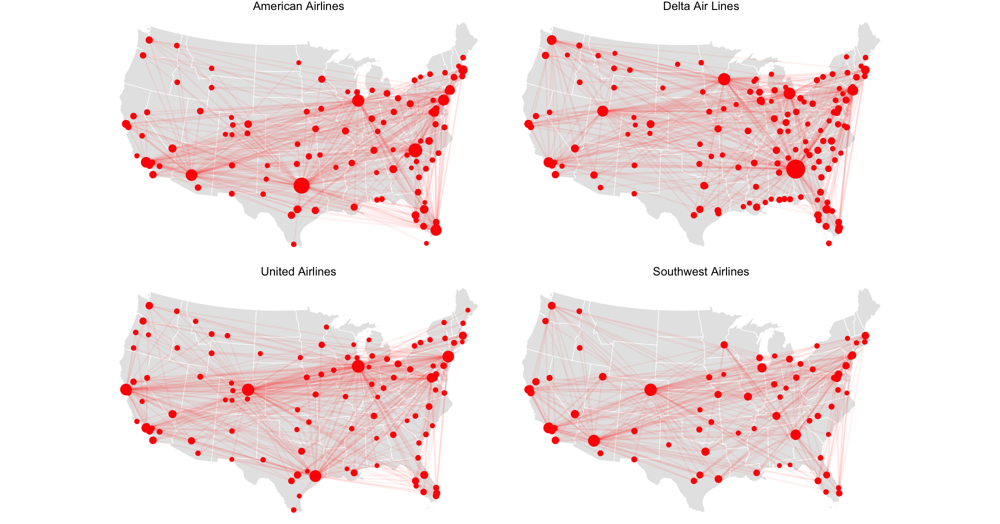

```{r setup, include=FALSE}
knitr::opts_chunk$set(echo = TRUE, eval = TRUE, warning = FALSE, message = FALSE)
```

## Packages needed

```{r}
library(tidyverse)
library(usmap)
library(sf)
```


## Dataset

The `flight_df_raw` data we have here is a complete record of all domestic flights for American, Delta, United, and Southwest in 2019 (`nycflights13::flights` contains only flights departing from NYC).

```{r}
flight_df_raw <- read_csv("data/flight_df.csv") |> select(-DepTime, -ArrTime)
airports_raw <- read_csv("data/airports.csv")
us_map_sf <-  us_map(regions = 'states') |> filter(!abbr %in% c("AK", "HI"))
```

This is some wrangling to match the coordinate reference system (CRS) of the airports with the CRS of the US map (week 6 Monday).

```{r}
airports <- airports_raw |>
  # create an sf object
  st_as_sf(coords = c("x", "y"), crs = 4326) |>
  # transform to the same CRS as the us_map_sf
  st_transform(crs = st_crs(us_map_sf)) |>
  # extract the coordinates
  mutate(x = st_coordinates(geometry)[,1], y = st_coordinates(geometry)[,2]) |>
  # focus on airports on continental US
  filter(between(x, -3000000, 3000000), y < 700000) |>
  # clean up
  rename(airport = ident) |>
  as_tibble() |>
  select(airport, x, y)

airports
```


## Your goal

```{r out.width="100%", echo = FALSE}

```

How many layers (`geom_*()`) do you think this plot contains? Sketch a general `ggplot2` skeleton you could use to build it.

**Your answer:**


## Points representing the airports

What should your airport point data look like to fit the `ggplot2` syntax above? Sketch the data frame you'd want: What does each row represent? Which columns does it need?


**Your answer:**


Can you implement the above from the `flight_df_raw` data? You may iterate a few times between these two steps. 

```{r}
nodes_df <- flight_df_raw |>
  # this function standardizes the variable names to lowercase with underscores
  janitor::clean_names() 
   
```

## Lines representing the routes

Repeat the same process for the routes. What should your airport point data look like to fit the `ggplot2` syntax above? Again what does each row represent, and which columns does it need?


**Your answer:**


Now build this route data frame from `flight_df_raw`. Again, you may need to iterate between sketching and coding.

```{r}
routes_df <- flight_df_raw |>
  janitor::clean_names() 
  
```
 
## Final plot - Assembling the components

With a data frame ready for each layer, put everything together and build the final plot.

```{r results='hold'}


```

When you run your code, `ggplot2` may produce warnings like these:

````
1: Removed xxx rows containing missing values or values outside the scale range (`geom_point()`). 
2: Removed xxx rows containing missing values or values outside the scale range (`geom_line()`). 

````


These warnings tell you that some rows have missing values, so `ggplot2` dropped them before plotting. Can you investigate into these missingness? 
